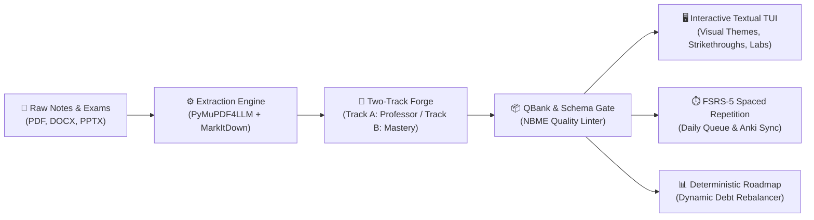

# PDF-School 📚

[](https://github.com/your-org/pdf-school/actions/workflows/ci.yml)
[](https://www.python.org/)
[](LICENSE)
[](https://github.com/astral-sh/ruff)
[](http://mypy-lang.org/)
[](https://github.com/open-spaced-repetition/fsrs)

> **The UNIX-style agentic study engine:** Convert course notes, textbooks, and past exams into high-yield question banks, FSRS spaced repetition schedules, and interactive terminal examinations with zero distraction and zero cloud lock-in.

---

## ⚡ Overview

**PDF-School** reproduces the high-yield learning and examination experience of commercial platforms (Bootcamp.com, UWorld, AMBOSS) inside your terminal. It bridges raw academic course materials into active-recall question banks, cognitive error taxonomy, and deterministic pacing schedules.



---

## ✨ Key Features

- **Two-Track Pedagogical Design**:
  - **Track A (Professor Style Alignment)**: Ingest past exams from `sources/past_exams/` via `pdf-school profile` to clone your professor's exact testing voice, option count, and slide-level question patterns.
  - **Track B (Pedagogical Mastery Mode)**: Grounded in cognitive psychology—enforces 2nd-order clinical reasoning, competitive differential lures, refutational feedback, and contrasting case tables.
- **Interactive Visual Terminal TUI**:
  - Full-screen graphical interface built with **Textual**.
  - **Dynamic Theme Switching** (`t` key): Dracula, Monokai, Solarized Dark, Solarized Light, Nord, Gruvbox, Catppuccin Mocha, and Tokyo Night.
  - Split-screen layout: question vignette, interactive choice selection, distractor elimination strikethroughs, educational objectives, source chunk peeks, and standard medical lab reference values.
- **FSRS-5 Spaced Repetition**: Modern DSR (Difficulty, Stability, Retrievability) memory modeling dynamically replaying your immutable history log.
- **Deterministic Zero-LLM Roadmap Pacing**: Mathematical study debt calculation and dynamic rebalancing (`pdf-school roadmap rebalance`) without hallucinating dates or dropping rest days.
- **Bi-Directional Anki Bridge**: Live 1-click sync to Anki via AnkiConnect or TSV export.
- **UNIX Philosophy & Privacy First**: Everything runs locally. All data is stored in plain, human-readable JSON Lines (`.jsonl`).

---

## 🚀 60-Second Quickstart

### 1. Installation
Using [`uv`](https://github.com/astral-sh/uv) (recommended) or `pip`:

```bash
# Clone the repository
git clone https://github.com/your-org/pdf-school.git
cd pdf-school

# Install package in editable mode
uv pip install -e .
```

### 2. Configure LLM Backend (Zero Lock-In)
Set your preferred API key in `.env` or your shell environment:

```bash
# Gemini (Google)
echo "GEMINI_API_KEY=your_key_here" > .env

# OpenAI / OpenRouter / Anthropic
echo "OPENAI_API_KEY=sk-..." > .env
# echo "ANTHROPIC_API_KEY=sk-ant-..." > .env

# Local Ollama / vLLM (Zero API Cost)
echo "OPENAI_BASE_URL=http://localhost:11434/v1" > .env
```

### 3. Ingest Course Materials
```bash
# Ingest PDF textbooks, PowerPoint slides, or Word notes
pdf-school ingest sources/endocrinology_guide.pdf
```

### 4. (Optional) Profile Past Exams
```bash
# Analyze past quizzes to clone the professor's style
pdf-school profile --input sources/past_exams/
```

### 5. Auto-Forge High-Yield Questions
```bash
# Forge 10 NBME-compliant clinical vignettes from extracted chunks
pdf-school forge --chunk-file content/endocrinology_guide_chunks.jsonl --count 10
```

### 6. Launch the Visual Examination Suite
```bash
# Launch the interactive Textual TUI
pdf-school tutor
```

---

## ⌨️ CLI Command Reference

| Command | Description |
| :--- | :--- |
| `pdf-school doctor` | System health check (Python, QBank count, history logs, LLM backend, AnkiConnect) |
| `pdf-school ingest <file_or_dir>` | Extract multi-format documents (PDF, DOCX, PPTX) into structured chunks |
| `pdf-school profile [--input DIR]` | Synthesize a Track A Professor Style Profile from past exams |
| `pdf-school forge --chunk-file FILE` | Generate NBME-compliant questions from course chunks using active LLM |
| `pdf-school tutor [--adaptive]` | Launch interactive full-screen Textual TUI exam (or `--cli-mode` for headless) |
| `pdf-school schedule [--date DATE]` | Calculate today's FSRS spaced repetition review deck and study block |
| `pdf-school roadmap today` | View today's curricular module, vignette quota, checkpoint, and tasks |
| `pdf-school roadmap status` | Global progress, active study days elapsed, and backlog deficit |
| `pdf-school roadmap rebalance --spread N` | Deterministically redistribute study debt across $N$ upcoming active days |
| `pdf-school sync anki` | Push flashcards directly to running Anki via AnkiConnect |
| `pdf-school sync tsv` | Export flashcards to TSV for manual Anki import |
| `pdf-school sync db` | Compile `.jsonl` data into SQLite `study.db` for SQL queries |

---

## 🎮 TUI Keybindings & Controls

| Key | Action |
| :---: | :--- |
| `1` - `5` / `a` - `e` | Select choice option (A through E) |
| `Enter` | Submit choice and trigger confidence calibration |
| `x` | Toggle strikethrough distractor elimination on current selection |
| `n` / `p` | Navigate to Next / Previous question |
| `f` | Flag / unflag question for later review |
| `t` | Cycle visual color themes (Dracula, Monokai, Nord, Gruvbox, Tokyo Night...) |
| `v` | Toggle Source Peek tab (view original textbook chunk & figures) |
| `l` | Toggle Reference Lab Values tab (CBC, BMP, LFTs, ABGs) |
| `r` | Toggle Curricular Roadmap tab (daily target & milestone countdown) |
| `q` | Exit examination session |

---

## 📊 Metacognitive Calibration & Error Taxonomy

When completing questions in Tutor mode, `pdf-school` logs:
1. **Confidence Rating**: *Certain*, *Educated Guess*, or *Blind Guess*.
2. **Error Taxonomy**: Categorizes misses into **Knowledge Gap**, **Misconception**, or **Execution Error**.
3. **Answer Switching**: Tracks time spent and detects negative second-guessing patterns.

Run `tools/study_db.py report` to view your analytical mastery tables and Dunning-Kruger calibration index.

---

## 🏛️ Architecture Decision Records (ADRs)

Key architectural decisions are documented in [`docs/adr/`](docs/adr/):
- [ADR 001: UNIX Philosophy & Plain JSONL Storage](docs/adr/001-unix-philosophy-plain-jsonl.md)
- [ADR 002: FSRS-5 vs. Legacy SM-2 Spaced Repetition](docs/adr/002-fsrs-5-spaced-repetition.md)
- [ADR 003: Terminal Textual TUI vs. Web GUI](docs/adr/003-textual-terminal-tui.md)
- [ADR 004: Hybrid Extraction via PyMuPDF4LLM & Microsoft MarkItDown](docs/adr/004-multiformat-extraction.md)
- [ADR 005: Deterministic Zero-LLM Roadmap Pacing & Dynamic Rebalancer](docs/adr/005-deterministic-roadmap-pacing.md)

---

## 🧪 Testing & Verification

Run the automated verification suite:

```bash
# Fast lint and style check
ruff check . && ruff format --check .

# Static type check
mypy src/ tests/

# Run 62 automated unit and integration tests with coverage
pytest --cov=src/pdf_school --cov-report=term
```

---

## 🤝 Contributing

Contributions are warmly welcomed! Please read our [**Contributing Guide**](CONTRIBUTING.md) and [**Code of Conduct**](CODE_OF_CONDUCT.md) to get started.

---

## 📄 License

Distributed under the **MIT License**. See [`LICENSE`](LICENSE) for more information.
